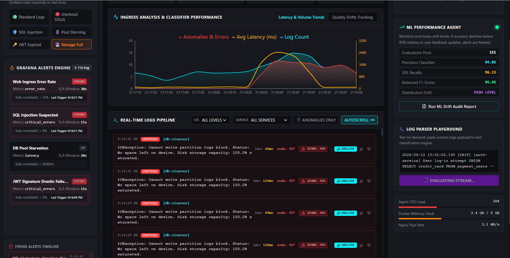
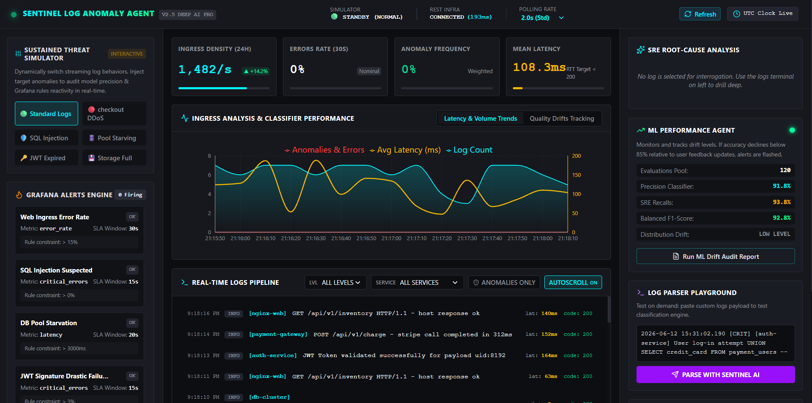
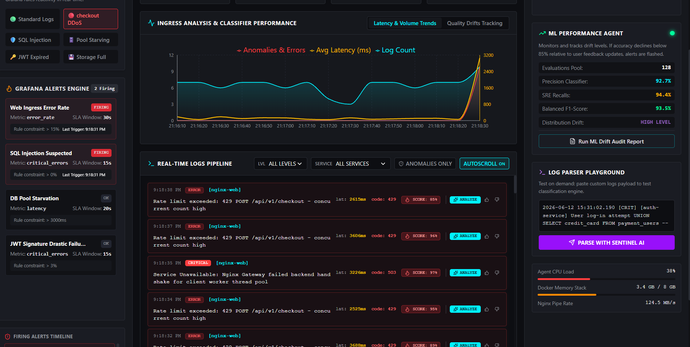
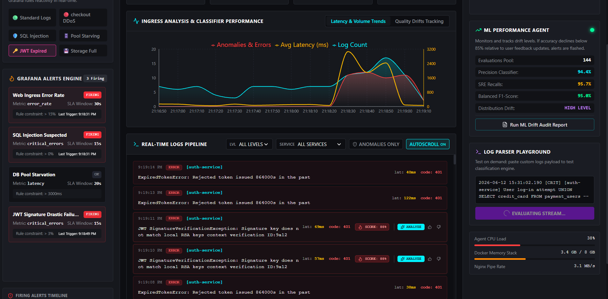

<div align="center">

SENTINEL — Log-Based Anomaly Detection Agent

AI-Powered Real-Time Log Intelligence, Threat Detection & Root Cause Analysis using Python, Docker, REST APIs, Stream Processing & ML Monitoring

SENTINEL is an intelligent log-anomaly detection platform designed to process streaming infrastructure and application logs, identify anomalies in real time, surface probable root causes, monitor model drift, and assist Site Reliability Engineering (SRE) workflows with AI-assisted diagnostics.

Built to simulate production-grade observability pipelines, SENTINEL combines real-time telemetry, anomaly scoring, Grafana-style alerting, log parsing intelligence, and ML-based performance monitoring into a unified monitoring platform.

</div>

<br>

<p align="center">
  
  
  
  
  
</p>

---

System Overview

Modern distributed systems generate thousands of logs every second.

Teams often struggle with:

- Identifying anomalies in massive streaming logs
- Diagnosing production failures quickly
- Detecting API abuse and security incidents
- Monitoring service degradation
- Tracking drift in system performance
- Understanding root causes without manual investigation

SENTINEL solves this by providing an intelligent log monitoring and anomaly detection platform capable of:

✅ Real-time log ingestion

✅ AI-assisted anomaly detection

✅ Root cause analysis

✅ Grafana-style alert triggering

✅ ML performance monitoring

✅ Service degradation detection

✅ Authentication anomaly tracking

✅ Infrastructure observability

---

Platform Preview

Live Monitoring Dashboard

The platform continuously processes streaming logs and evaluates infrastructure health, latency patterns, anomaly rates, and system behavior in real time.

<br>

<p align="center">
  
</p>

---

Project Objectives

The system was designed to:

✅ Detect infrastructure anomalies automatically

✅ Monitor streaming logs continuously

✅ Surface probable root causes

✅ Detect authentication failures

✅ Detect latency spikes & outages

✅ Monitor ML drift and degradation

✅ Simulate SRE production incidents

✅ Improve operational visibility

---

Core Features

Real-Time Log Monitoring

- Streaming log ingestion
- Timestamp-based ordering
- Log classification
- Severity filtering
- Service-level monitoring
- Autoscroll telemetry

AI-Powered Log Parsing

- Pattern-based classification
- Failure categorization
- Intelligent anomaly scoring
- Root-cause suggestions
- Confidence estimation

Grafana-Style Alert Engine

- Real-time alert generation
- Trigger thresholds
- Error-rate monitoring
- Security anomaly alerts
- Latency SLA violations

ML Performance Agent

- Precision monitoring
- Recall tracking
- F1-score evaluation
- Confidence degradation detection
- Distribution drift analysis

Security Monitoring

- JWT authentication failures
- SQL injection signatures
- DDoS traffic spikes
- Service abuse detection
- Database starvation monitoring

Observability Layer

- Service telemetry
- Request latency tracking
- Throughput monitoring
- Error distributions
- Performance analytics

---

Architecture Workflow

```txt
User/Application Logs
            │
            ▼
   Streaming Log Pipeline
            │
            ▼
   Log Parsing & Classification
            │
            ├─────────────► Rule-Based Detection
            │                    │
            │                    ▼
            │             Threat Signatures
            │
            ├─────────────► ML Detection Engine
            │                    │
            │                    ▼
            │             Anomaly Scoring
            │
            ▼
     Alert Trigger Engine
            │
            ▼
     Root Cause Analysis
            │
            ▼
      Monitoring Dashboard
```

---

Technology Stack

| Technology | Purpose |
|------------|----------|
| Python | Backend logic |
| REST APIs | Service communication |
| Docker | Containerized deployment |
| Logging Frameworks | Streaming logs |
| Pandas | Data processing |
| NumPy | Numerical operations |
| Scikit-learn | ML analytics |
| Streamlit | Monitoring dashboard |
| Grafana-style Alerts | Incident monitoring |

---

Project Structure

```txt
SENTINEL/
│── assets/
│   ├── sentinel-overview-dashboard.png
│   ├── sentinel-ddos-detection.png
│   ├── sentinel-jwt-anomaly.png
│   └── sentinel-normal-monitoring.png
│
│── app/
│   ├── main.py
│   ├── dashboard.py
│   ├── anomaly_engine.py
│   ├── classifier.py
│   ├── parser.py
│   ├── monitoring.py
│   └── root_cause.py
│
│── agents/
│   ├── ml_agent.py
│   ├── log_parser_agent.py
│   └── drift_monitor.py
│
│── logs/
│   ├── simulated_logs.json
│   └── pipeline_logs.txt
│
│── docker/
│   ├── Dockerfile
│   └── docker-compose.yml
│
│── requirements.txt
│── .env
│── README.md
```

---

Real-Time Monitoring Dashboard

The monitoring layer continuously tracks latency, ingestion volume, anomaly spikes, and service performance.

<br>

<p align="center">
  
</p>

Capabilities:

✅ Error tracking

✅ Throughput analysis

✅ Latency monitoring

✅ Service health visibility

✅ Live telemetry

---

DDoS & Service Failure Detection

The anomaly engine identifies service degradation and unusual spikes in infrastructure behavior.

Examples:

- Checkout API failures
- HTTP 429 spikes
- Gateway overloads
- Latency explosions
- Resource exhaustion

<br>

<p align="center">
  
</p>

Detected signals:

✅ DDoS spikes

✅ Request flooding

✅ Latency anomalies

✅ API bottlenecks

---

JWT Authentication & Security Detection

SENTINEL monitors suspicious authentication behaviors including:

- Invalid JWT signatures
- Token expiration failures
- Unauthorized login attempts
- Authentication abuse

<br>

<p align="center">
  
</p>

Security insights include:

✅ Expired tokens

✅ Invalid authentication payloads

✅ Login abuse detection

✅ Access-control anomalies

---

ML-Based Performance Monitoring

The ML monitoring engine continuously tracks model quality metrics.

Monitored metrics include:

- Precision
- Recall
- F1-score
- Confidence levels
- Distribution drift

This allows the system to identify performance degradation before failures occur.

---

Installation Guide

Prerequisites

Install:

- Python 3.10+
- Docker Desktop
- Git

Clone Repository

```bash
git clone https://github.com/yourusername/SENTINEL.git
cd SENTINEL
```

Create Virtual Environment

Windows

```bash
python -m venv venv
venv\Scripts\activate
```

Mac/Linux

```bash
python3 -m venv venv
source venv/bin/activate
```

Install Dependencies

```bash
pip install -r requirements.txt
```

---

Environment Variables

Create `.env`

```env
APP_ENV=development
LOG_LEVEL=INFO
API_PORT=8501
MODEL_THRESHOLD=0.85
DRIFT_THRESHOLD=0.15
LATENCY_ALERT_MS=3000
```

---

Run Application

Run Streamlit Dashboard

```bash
streamlit run app/dashboard.py
```

Run Backend

```bash
python app/main.py
```

---

Docker Setup

Build Container

```bash
docker build -t sentinel .
```

Run Container

```bash
docker run -p 8501:8501 sentinel
```

Using Docker Compose

```bash
docker-compose up --build
```

---

Sample Log Events

```log
[CRITICAL] [db-cluster]
IOException: Cannot write partition logs block
Status: Disk storage capacity saturated
```

```log
[ERROR] [auth-service]
JWT SignatureVerificationException:
Signature key mismatch
```

```log
[WARNING] [nginx-web]
Rate limit exceeded:
429 POST /api/v1/checkout
```

---

Use Cases

SENTINEL can be used for:

- DevOps monitoring
- SRE incident response
- Infrastructure observability
- Authentication monitoring
- API failure diagnostics
- Log anomaly detection
- Production debugging
- ML system monitoring

---

Business Impact

✅ Reduced manual log analysis

✅ Faster anomaly identification

✅ Faster root cause investigation

✅ Better operational visibility

✅ Improved reliability monitoring

✅ Automated incident surfacing

---

Future Enhancements

- Kafka-based real log streaming
- OpenTelemetry integration
- Kubernetes monitoring
- Slack/Email alerts
- LLM-powered RCA summaries
- Elasticsearch indexing
- Predictive incident detection
- Multi-agent observability

---

Author

**Sankeerthana Verneni**

Aspiring Software Engineer • AI/ML Engineer • DevOps & Observability Enthusiast
